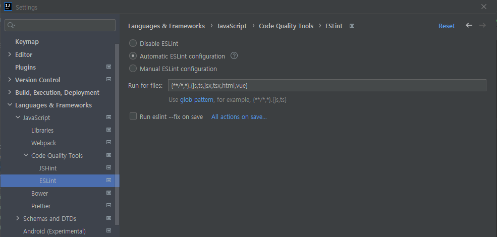
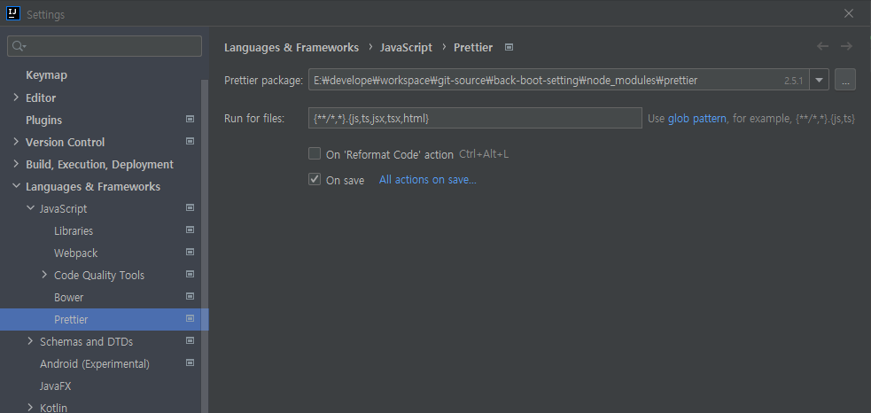

# 1.WEBPACK

### # 구현 내용
#### 1. Webpack 적용
- Babel 적용 (ES6)
- CSS, SCSS 적용
- 이미지 압축 처리
- CleanWebpackPlugin 적용(빌드시 기존 DIST 삭제 처리)
- Define Plugin 적용(공통 변수 예제)
- watch 설정

#### 2. thymeleaf 형식의 기본 레이아웃 구성

#### 3. prettier, eslint 적용

<hr/>

### # 사용방법
dependencies를 설치해야 한다. npm이 설치된 상태에서 터미널에서 아래 구문을 실행 시킨다.

```
npm install
```

js나 css를 수정한 후에 웹팩에 적용을 하려면 아래 구문을 실행 시킨다.

```
npx webpack 
```
또는

```
npm run webpack
```

dist 폴더가 생성되고 config.js에 js와 css가 포함된채 생성된다. 이미지가 있다면 압축된 이미지가 생성이 된다.
(npm run dev 실행시 watch가 실행되서 수정 사항이 있을때마다 빌드가 된다.)

<hr/>

eslint, prettier를 적용하려면 각자 사용하는 IDE에 각 플러그인을 설치하고 적용을 해줘야 한다.
intellij를 기준으로 한다면
- eslint는 setting < Languages & Frameworks < Javascript <Code Quality Tool < ESLint에서 Automatic으로 설정해주면 된다.
  
- prettier는 setting < Languages & Frameworks < Prettier 에서 On Save를 선택하면 된다.
  

혹시 Please specify path to 'eslint' package
이 구문이 나온다면
```
npm install --g eslint
```
전역설치를 해주고 IDE를 재실행하면 해결이 된다.

<hr/>

### # 권장사항
config.js에는 공통적으로 사용하는 js나 css를 import 하고 그 외에 개별 js를 작성해서 따로 처리하는 걸 추천한다.


